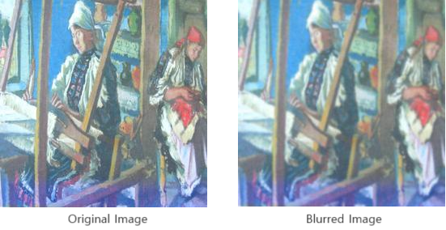

# ArtCaptioning
### DBDBDeep Final Project, Fall 2023 AAI3201

## Introduction
ArtCaptioning is an innovative project aimed at translating visual art into vocal interpretations using advanced AI techniques. This project represents a unique intersection of technology and art, exploring new frontiers in AI applications.

## Project Overview
The ArtCaptioning project focuses on using AI models to understand and interpret visual artworks and convert these interpretations into spoken words. This approach opens new possibilities in how we interact with and understand art through technology.

## Model Structure
This project underwent several iterations in its model structure to achieve the optimal balance between accurate image interpretation and effective vocal translation. Below are the key stages of our model development:

### Initial Model: ResNet and LSTM
- **ResNet (Residual Neural Network)**: We initially employed ResNet for its proven effectiveness in image recognition tasks. This deep neural network, known for its ability to train hundreds of layers without performance degradation, was crucial in accurately identifying key elements and nuances within artworks.
- **LSTM (Long Short-Term Memory)**: Paired with ResNet, we used LSTM networks for generating descriptive captions. LSTMs are a type of recurrent neural network (RNN) particularly suited for sequential data. In this context, they were tasked with translating the visual data processed by ResNet into coherent, descriptive language.

### Changed Model: Transformer (ViT) and LSTM
- **Vision Transformer (ViT)**: As the project progressed, we shifted to using Vision Transformers for image recognition. ViT represents a significant advancement in computer vision, bringing the benefits of transformer models (originally designed for NLP tasks) to the realm of image processing. This change was aimed at harnessing the transformer's ability to capture global dependencies in the image data.
- **Integration with LSTM**: We retained the LSTM for caption generation, allowing us to leverage its sequential data processing capabilities while enhancing the image recognition component with ViT.

### Final Model: Transformer (ViT) and Transformer (GPT-2)
- **GPT-2 Integration**: In our final iteration, we introduced another transformer model, GPT-2, for language generation. GPT-2, known for its powerful language understanding and generation capabilities, brought a significant improvement in the quality and relevance of the generated captions.
- **End-to-End Transformer-Based Architecture**: With both ViT and GPT-2, our model became a fully transformer-based system. This architecture allowed for more advanced understanding and processing of both visual and textual data, leading to more accurate and contextually relevant vocal interpretations of art.

## Data Sources and Processing

In this project, we meticulously selected and processed data sources to train our models effectively. Our focus was on datasets that provided a rich variety of images along with descriptive captions, which were crucial for teaching our models to interpret and describe visual art. Here’s how we approached this aspect of the project:

### Datasets Used
- **Flickr8k**: Initially, we considered the Flickr8k dataset, known for its diverse collection of 8,000 images, each accompanied by five different captions. This dataset is often used in image captioning tasks due to its rich descriptive content.
- **COCO Dataset**: We ultimately chose the COCO (Common Objects in Context) dataset for its extensive library of over 330,000 images and 200,000 labeled images. COCO is renowned for its variety in image content and the contextual richness of its captions, making it an ideal choice for training our models.

### Data Processing
- **Image Selection and Preprocessing**: From the COCO dataset, we selectively used images that closely aligned with our project's focus on art. This involved filtering for images with artistic elements and ensuring a wide representation of styles and subjects. We then preprocessed these images for optimal compatibility with our AI models, which included resizing, normalization, and augmentation techniques to enhance model training.
- **Caption Processing**: The captions accompanying these images were also processed to ensure consistency and relevance. This involved cleaning and standardizing the text, removing irrelevant or nonsensical captions, and sometimes augmenting the data with additional descriptive language to better suit the artistic context.

### Fine-Tuning for Art Images
- **Transfer Learning**: To better adapt the COCO dataset to our specific use case of interpreting art, we additionally utilized the ArtCap dataset. The ArtCap dataset is dedicated to artworks and includes about 3,000 images with 15,000 captions. We fine-tuned the model trained on the COCO dataset with this art-specific dataset to enhance its performance in art interpretation.

- **Data Augmentation Using Blur Processing**: Since the ArtCap dataset has fewer data points compared to the COCO dataset, we employed data augmentation techniques to enhance our dataset. We used a blur processing technique with a radius of 1, which allowed us to effectively double our dataset size to a total of 6,000 images.

    

## Model Evaluation

Evaluating the performance of our AI models was a critical component of the ArtCaptioning project. Our evaluation process was designed to assess both the accuracy of image interpretation and the relevance and coherence of the generated captions. Here’s how we conducted the model evaluation:

### Evaluation Metrics
- **Image Interpretation Accuracy**: We used standard image recognition metrics such as Precision, Recall, and F1-Score to evaluate the accuracy of the image interpretation component of our models. These metrics helped us assess how effectively the model identified and understood the key elements and themes in the artworks.
- **Caption Quality Assessment**: For the language generation aspect, we employed BLEU (Bilingual Evaluation Understudy) scores to measure the linguistic quality of the generated captions. BLEU scores are widely used in machine translation and text generation to evaluate the similarity between machine-generated text and reference (human-written) text.

    

### Comparative Analysis
- **Model-to-Model Comparison**: We conducted comparative analyses between different iterations of our models (ResNet-LSTM, ViT-LSTM, and ViT-GPT-2) to understand the improvements and changes in performance. This involved side-by-side comparisons of the accuracy and quality of the outputs generated by each model configuration.
- **Baseline Comparison**: Additionally, we compared our models' performance against established baselines in the field of image captioning. This helped us contextualize our results within the broader landscape of AI-driven art interpretation.

### Continuous Monitoring and Iteration
- **Feedback Loop**: Continuous monitoring of the model's performance was established, integrating user and expert feedback into ongoing iterations of the model. This iterative process was key to enhancing the model's accuracy and the quality of its output over time.
- **Error Analysis**: We systematically analyzed instances where the model underperformed or generated inaccurate captions. This error analysis was crucial in identifying specific areas for improvement and in refining the model for better performance.

## References and Acknowledgments

### Datasets
- **Flickr8k Dataset**: Details about this dataset can be found at [Flickr8k Dataset Resource](https://example-link-to-flickr8k-dataset.com).
- **COCO Dataset**: More information on the COCO dataset is available at [COCO Dataset Official Website](https://cocodataset.org/).

### Referenced Papers
- **Understanding Deep Image Representations by Inverting Them**: Mahendran, A., & Vedaldi, A. (2014). [Link to Paper](https://arxiv.org/abs/1411.4555).
- **ViT-GPT2 Image Captioning**: An exploration of using Vision Transformer (ViT) and GPT-2 for image captioning. [Link to Project Page](https://huggingface.co/nlpconnect/vit-gpt2-image-captioning).
- **Data Augmentation for Image Captioning**: [2106.05437] Data augmentation to improve robustness of image captioning solutions. [Link to Paper](https://arxiv.org/abs/2106.05437).
- **ArtCap: A Dataset for Image Captioning of Fine Art Paintings**: This paper discusses a specialized dataset for image captioning in the context of fine art. [Link to IEEE Xplore](https://ieeexplore.ieee.org/abstract/document/9965360).

### Collaborators
A special thanks to our collaborators who played a pivotal role in the development and success of the ArtCaptioning project. Their expertise, commitment, and innovative ideas were invaluable in bringing this project to fruition.
- [Kimsangwon-0523](https://github.com/Kimsangwon-0523)
- [tilleyshen](https://github.com/tilleyshen)
- [supernova236](https://github.com/supernova236)
